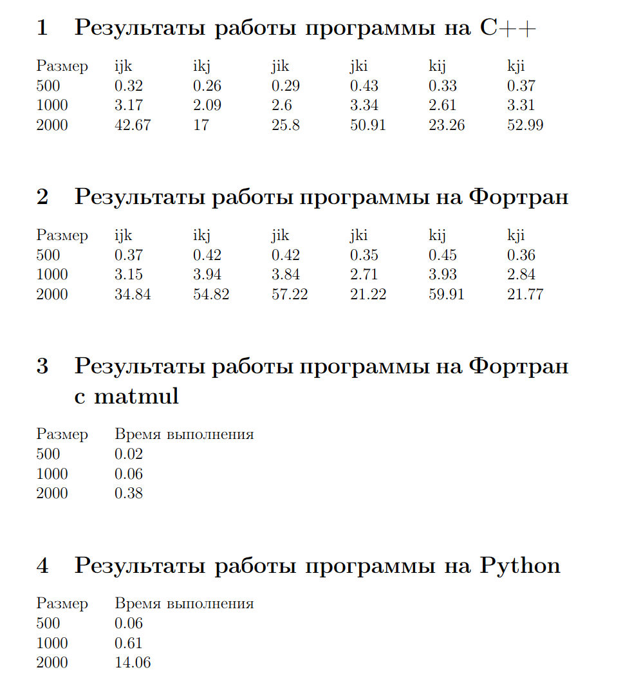

# Лабораторная работа по теме Тема «Использование современных компиляторов C(C++) и Фортран при решении задач обработки матриц большой размерности»
## Постановка задачи: Написать программу, реализующую классический алгоритм умножения квадратных матриц на С(С++) и Фортране и Python. Определить лучший порядок циклов. Оценить быстродействие написанных программ для матриц размерностей 500х500, 1000х1000, 2000х2000. Сравнить быстродействие написанных программ со встроенной функцией Фортрана matmul.
## Результаты работы программ:

